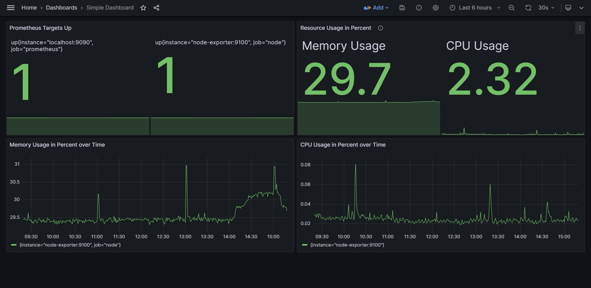

# grafaml

Create Grafana Dashboards from YAML using Helm Chart templating.

This YAML:

```yaml
title: "Simple Dashboard"
panels:
  columns: 2
  panelHeight: 8
  list:
    - title: "Prometheus Targets Up"
      type: "stat"
      targets:
        - expr: "up"

    - title: "Resource Usage in Percent"
      description: "Memory and CPU Usage"
      type: "stat"
      targets:
        - expr: "(1 - (node_memory_MemAvailable_bytes / node_memory_MemTotal_bytes)) * 100"
          legendFormat: "Memory Usage"
        - expr: "sum by (instance, job)(avg by (mode, instance) (rate(node_cpu_seconds_total{mode!='idle'}[2m]))) * 100"
          legendFormat: "CPU Usage"

    - title: "Memory Usage in Percent over Time"
      type: "timeseries"
      targets:
        - expr: "(1 - (node_memory_MemAvailable_bytes / node_memory_MemTotal_bytes)) * 100"

    - title: "CPU Usage in Percent over Time"
      type: "timeseries"
      targets:
        - expr: "sum by (instance, job) (avg by (mode, instance) (rate(node_cpu_seconds_total{mode!='idle'}[2m])))"
```

Becomes this dashboard:



## Problems Grafaml Addresses

1. **Grafana UI**: Creating and editing Dashboards in the Grafana UI can be a painstaking and slow process.

2. **Grafana JSON Model**: Creating and editing Dashboards via the Grafana JSON model is complicated,
due to the complexity of the JSON model and the absolute positioning of panels.

3. **Version Control**: Tracking dashboard changes in Git with the Grafan JSON model is inefficient.
Even little changes to the dashboard can cause hundreds of lines to change.

## Features

**Create Dashboards from YAML**: Instead of using the Grafana UI or writing complex JSON models,
you can write simplified YAML files from which the dashboard JSON is generated.
With this, version control becomes efficient again.

**Grid-Based Panel Positioning**: Instead of worrying about the absolute positioning of every single panel,
Grafaml arranges panels based on their definition order in a grid with a flexible number of columns.

**Kubernetes Deployment**: Grafaml is a Helm Chart.
Grafana Dashboards can be deployed as ConfigMaps, which can optionally be discovered by the [Grafana Sidecar Container][1].

## Limitations

**Variable Positioning of Panels**: Panels are arranged in a grid based on their definition order.
Due to this, it is not possible to have panels with variable width or positioning.

## Getting started

### Creating the dashboard YAML

First we need to create a Helm Values file containing the definition of our dashboard.
We'll call the file `values-my-dashboard.json`.
It will define a very simple dashboard with only 2 panels:

```yaml
title: "Simple Dashboard"
panels:
  colums: 2
  panelHeight: 8
  list:
    - title: "Memory Usage in Percent over Time"
      type: "timeseries"
      targets:
        - expr: "(1 - (node_memory_MemAvailable_bytes / node_memory_MemTotal_bytes)) * 100"
    - title: "CPU Usage in Percent over Time"
      type: "timeseries"
      targets:
        - expr: "sum by (instance, job) (avg by (mode, instance) (rate(node_cpu_seconds_total{mode!='idle'}[2m])))"
```

You can find all possible configuration options in the [default `values.yaml`](./charts/grafaml/values.yaml)
and in the [`README.md` of the Helm Chart`](./charts/grafaml/README.md).

You can find example Dashboards in the [`example-dashboards`](./example-dashboards/) directory.

In the next step, the `values-my-dashboard.json` will be merged with the default [default `values.yaml`](./charts/grafaml/values.yaml),
from which the dashboard JSON will be generated.

### Generating the dashboard JSON

This step is optional if you want to [deploy the dashboard in a Kubernetes Cluster](#deploying-the-dashboard-in-kubernetes).

Execute this code in your Shell to create a `dashboard.json`:

```shell
# Adapt the variables to your needs
name="my-dashboard"
values="./values-my-dashboard.yaml"
helm template $name oci://registry-1.docker.io/ernail/grafaml --values $values --set onlyRenderDashboardJson=true | tail -n +3 > dashboard.json
```

### Deploying the dashboard in Kubernetes

Execute this code in your shell to deploy the dashboard as ConfigMap in Kubernetes:

```shell
name="my-dashboard"
values="./values-my-dashboard.yaml"
namespace="my-namespace"
helm upgrade $name oci://registry-1.docker.io/ernail/grafaml --install --create-namespace --namespace $namespace --values $values
```

If you are using the [Grafana Sidecar Container][1], the dashboard should now be available in your Grafana.

[1]: https://github.com/grafana/helm-charts/blob/main/charts/grafana/README.md#sidecar-for-dashboards

## Usage

The basic usage of Grafaml is already explained in the [Getting Started](#getting-started) section.
Any additional usage information is documented here.

### Using Helmfile

[Helmfile](https://github.com/helmfile/helmfile) is a declarative spec for deploying Helm Charts.
It can be used to simplify the commands for rendering and deploying the dashboards.

If you want to use Helmfile, here is an example `helmfile.yaml`:

```yaml
repositories:
  - name: "ernail"
    url: "registry-1.docker.io/ernail"
    oci: true

releases:
  - name: "my-dashboard"
    namespace: "my-namespace"
    chart: "ernail/grafaml"
    version: "1.0.0"
    values:
      - "./values-my-dashboard.yaml"
      - onlyRenderDashboardJson: false
```

Execute this code in your Shell to create a `dashboard.json`:

```shell
helmfile template --file ./helmfile.yaml --set onlyRenderDashboardJson=true | tail -n +3 > dashboard.json
```

Execute this code in your shell to deploy the dashboard as ConfigMap in Kubernetes:

```shell
helmfile apply --file ./helmfile.yaml
```

## Development

### Testing

```shell
helm unittest ./charts/grafaml
```

### Linting

```shell
pip install -r requirements.txt
pre-commit run --all-files
helm lint ./charts/grafaml
kube-linter lint ./charts/grafaml
```

### Templating

Using Helm:

```shell
helm template grafaml ./charts/grafaml
```

Using Helmfile:

```shell
helmfile template --file ./charts/grafaml/helmfile.yaml
```

### Deploying

Using Helm:

```shell
helm upgrade grafaml ./charts/grafaml --install --create-namespace --namespace grafaml
```

Using Helmfile:

```shell
helmfile apply --file ./charts/grafaml/helmfile.yaml
```

### Generating documentation

```shell
helm-docs ./charts/grafaml/
```
